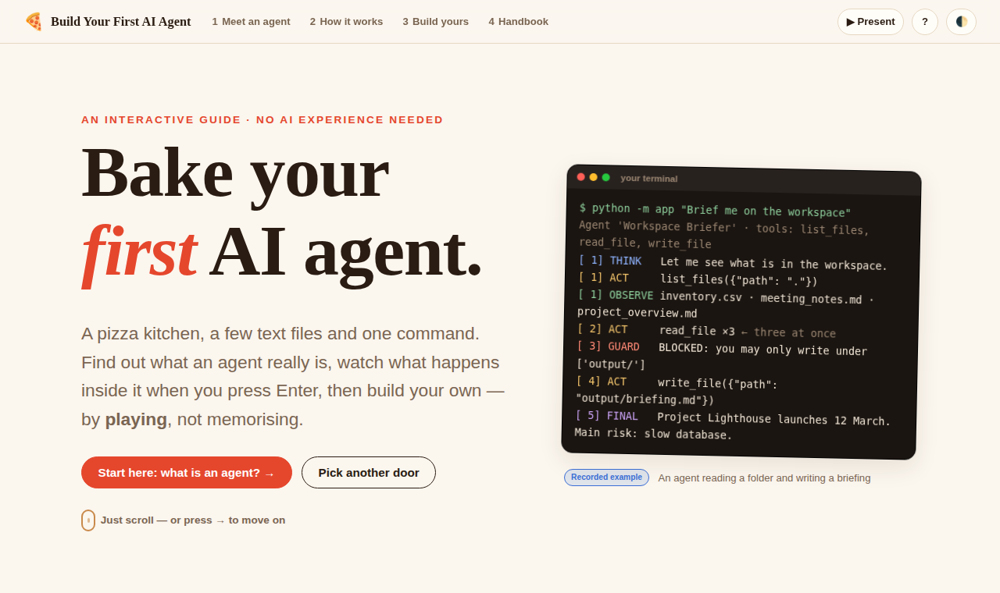
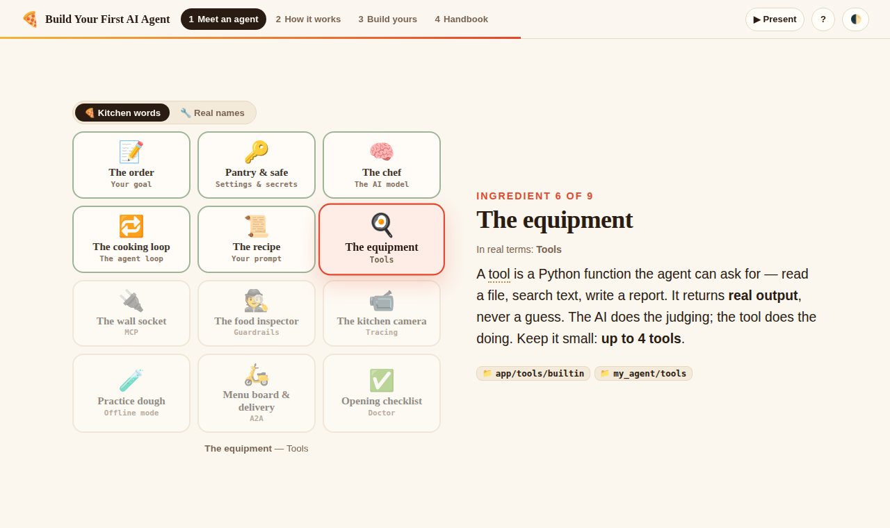
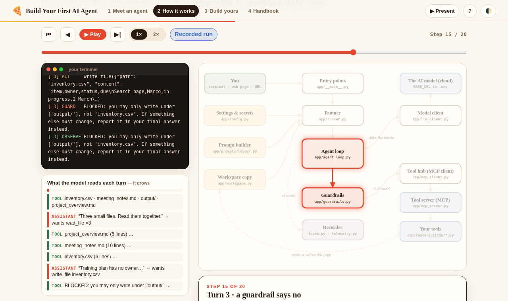
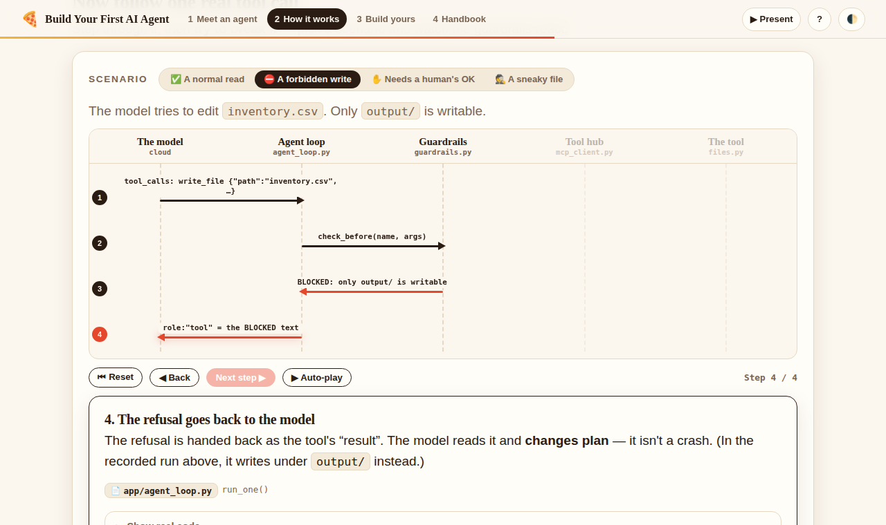
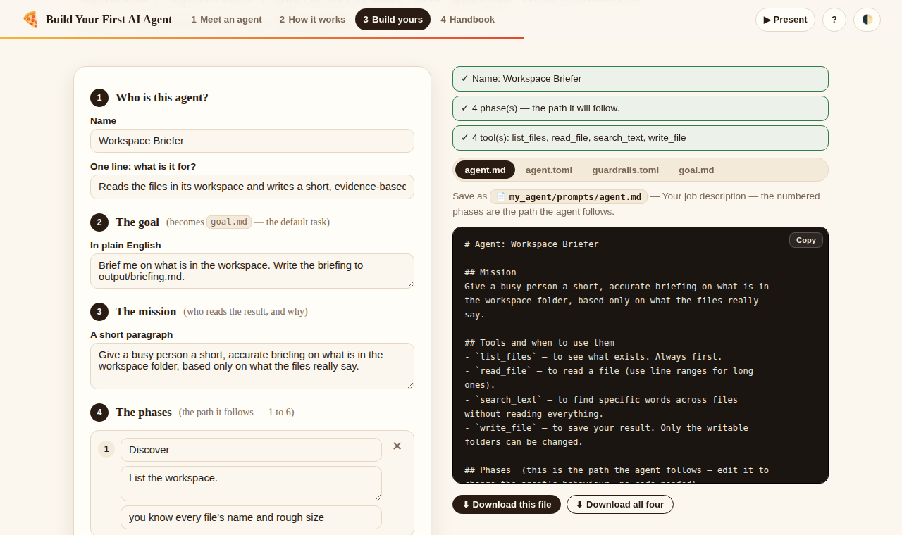

# Build Your First AI Agent

**An interactive, beginner-friendly guide to building your first AI agent — told as a pizza kitchen.**
No AI experience needed. You learn by *playing*: watch an agent work, press Enter and follow what happens file by file, shift the "gearbox" of a tool call, then build your own.

### 👉 **[Open the live guide](https://build-your-first-ai-agent.vercel.app)**



It is the companion guide to the [**workshop agent template**](https://github.com/csqa-agentix/workshop-agent-template) — a small, working agent that you turn into your own. This site explains that template; it is not the template itself.

---

## Who it's for

Complete beginners to AI agents — people who have chatted with an AI but have never built something that *acts*. Pick a door on the home page:

| If you are… | Start at | Time |
|---|---|---|
| 🌱 *“I've never heard of agents”* | **Meet an agent** | ~6 min |
| ⚙️ *“I get the idea — how does it really work?”* | **How it works** | ~12 min |
| 🔨 *“I want to build one now”* | **Build yours** | ~1 hour |

## Questions it answers

Not a FAQ — each one is a place you can *do* something:

1. **Which file is the “main” one — does `agent.md` call the others?** No. You start the agent with `python -m app`; `agent.md` and the skills are plain text the engine reads and joins into one prompt. → *How it works · Who starts the agent? · How your files become one prompt*
2. **How do I run it end to end — where do the key and my prompt go?** The key lives in `.env`; the goal comes from `--goal-file`, what you type, `my_agent/goal.md`, or the web page / a URL. → *How it works · Run it end to end*
3. **When I press Enter, what happens, and in what order?** → *How it works · Watch one run* (a recorded run you can play and scrub)
4. **When the agent “calls a tool”, what really happens?** → *How it works · The gearbox* (step through it, then try to break it)

---

## What's inside

| Page | File | What it does |
|---|---|---|
| **Home** `/` | `index.html` | The three doors, plus “continue where you left off”. |
| **1 · Meet an agent** `/journey` | `journey.html` | Chatbot-vs-agent, a watch-it-work demo with predict-and-reveal, the loop, a scroll-driven pizza-kitchen map (kitchen words ↔ real names), a peek at the real files. |
| **2 · How it works** `/how-it-works` | `how-it-works.html` | *Press Enter* simulator and the seven startup stages · how `agent.md` + skills + goal become one prompt · a four-zoom architecture map · a recorded-run player · the tool-call gearbox with four “break it” scenarios · *where is my file used?* · run it end to end. |
| **3 · Build yours** `/build` | `build.html` | A 20-step checklist that saves your progress, and a **blueprint builder** that generates `agent.md`, `agent.toml`, `guardrails.toml` and `goal.md`. |
| **4 · Handbook** `/handbook` | `handbook.html` → `present.html#hb-map` | The full written reference: folder maps, MCP, guardrails, tracing, troubleshooting, words explained. |
| **Present** `/present` | `present.html` | The original click-through slide deck, kept for workshops. Old links like `/#i7-mcp` and `/#hb-mcp` redirect here. |

<table>
<tr>
<td width="50%"><br><sub><b>Meet an agent</b> — the kitchen lights up as you scroll; toggle between pizza words and real names.</sub></td>
<td width="50%"><br><sub><b>How it works</b> — a recorded run: terminal, what the model reads, and which file is working right now.</sub></td>
</tr>
<tr>
<td width="50%"><br><sub><b>The gearbox</b> — one tool call, step by step. Here a guardrail refuses a forbidden write.</sub></td>
<td width="50%"><br><sub><b>Build yours</b> — answer six questions; your first agent files write themselves.</sub></td>
</tr>
</table>

---

## How it's designed

- **Three layers per idea.** *Glance* (a picture and one sentence) → *Play* (click, step, scrub, break it) → *Dive* (real code and GitHub links, folded away). Nothing is hidden — just folded until you want it.
- **Scroll, don't click-click-click.** Each chapter is a scrolling page. `→` / `←` jump between sections, a sticky bar shows where you are, and each chapter ends with a big **Next** card. A first-visit tip explains this once.
- **Learn by doing.** Predict-then-reveal questions, a goal-picking simulator, a scrubbable run, “break it” scenarios, a saved checklist and a file generator.
- **Honest examples.** The runs are *recorded* and labelled as such — simplified from the template's real log format, never presented as live model output.
- **Accessible and light.** Works on phones, in dark mode, by keyboard, and with `prefers-reduced-motion`. Reading works without JavaScript; the interactions need it. No build step, no dependencies, no external requests — it works offline.

| Key | Does |
|---|---|
| `→` / `←` | jump to the next / previous section |
| `?` | how to get around |
| `T` | light / dark |
| `Esc` | close help |

The slide deck (`/present`) keeps its own keys: `→` `Space` next · `←` back · `M` menu · `S` show all · `H` handbook · `T` theme · `F` full screen · `?` help.

## Accuracy

Every file name, function name and quoted message was checked against the template repo at commit [`70b4bf3`](https://github.com/csqa-agentix/workshop-agent-template/commit/70b4bf3). If the template changes, re-check those and update the commit shown at the bottom of *How it works*.

Tested in headless Chromium at 360–1440 px wide, in light and dark mode, with reduced motion, and with JavaScript off. **Not** yet tested on real phones, Safari or Firefox.

---

## Repository layout

```text
index.html            home — the three doors
journey.html          chapter 1 · Meet an agent
how-it-works.html     chapter 2 · How it works
build.html            chapter 3 · Build yours
handbook.html         redirect into the handbook (inside present.html)
present.html          the original slide deck + the handbook
assets/
  site.css · site.js          shared: top bar, theme, saved progress, glossary tooltips, first-visit tip
  diagram.js                  the architecture diagram (nodes, edges, per-box explanations)
  journey.* · how.* · build.* one stylesheet/script pair per page
docs/screenshots/     images used in this README
vercel.json           clean URLs (/how-it-works → how-it-works.html) and cache headers
```

## Run it locally

```bash
python3 -m http.server 8000      # then open http://localhost:8000
```

Any static server works. Saved progress (checklist ticks, “continue where you left off”) is kept in your browser's `localStorage`.

## Updating the content

- The template repo address is set in `assets/site.js` (`REPO`, `BRANCH`) and in `present.html`.
- `assets/diagram.js` holds the architecture: boxes, lines and what each box does.
- `assets/how.js` holds the recorded run, the seven stages, the gearbox scenarios and the “where is my file used?” data.
- `assets/journey.js` holds the demos and the kitchen steps; `assets/build.js` holds the checklist, the blueprint generators and the troubleshooting answers.
- Words with a dotted underline come from the glossary in `assets/site.js`; add a term there, then mark it up as `<span data-g="term">`.

## Deploy to Vercel (free)

**From GitHub (recommended: every `git push` redeploys)**
1. Push this repo to GitHub.
2. vercel.com → *Add New… → Project* → import the repo → Framework preset **Other** → leave build settings empty → Deploy.

**Vercel CLI**
```bash
npx vercel --prod      # first time: log in, accept the defaults ("Other" framework, no build command)
```

Vercel serves `index.html` at the root; `vercel.json` handles the clean URLs.

---

Hand-tossed with love by [**KINJALK**](https://www.linkedin.com/in/kinjalk-jain) — found it useful? Come say hi on LinkedIn.
Licensed under the [MIT License](LICENSE).
